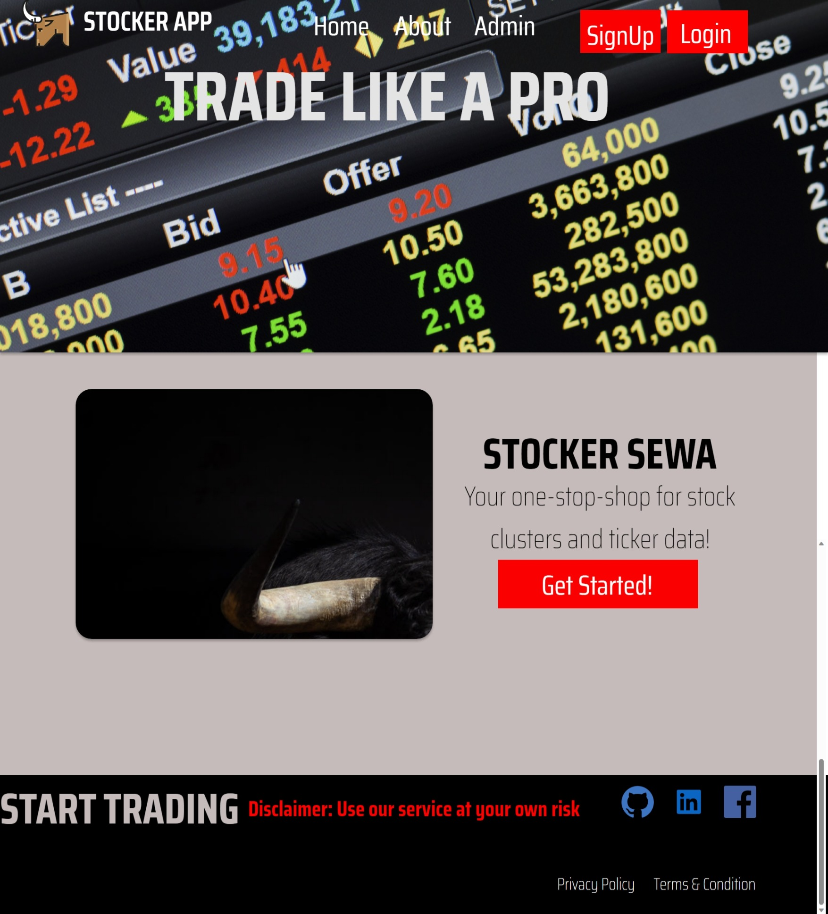
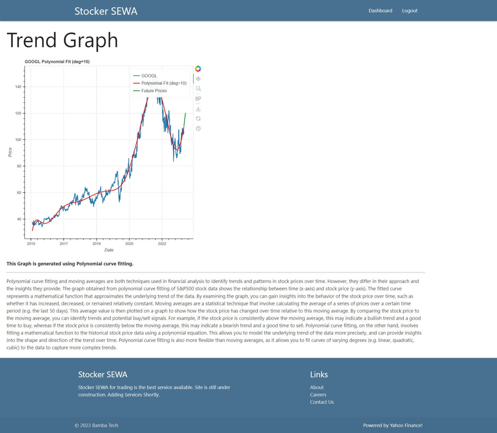

# Stocker SEWA

The Stocker SEWA web application is designed to provide effective analysis of S&P500 data, allowing users to make informed investment decisions. This paper describes the development of Stocker SEWA, which offers a range of services, including moving average predictors, sentiment analysis, candlestick chart viewing, and clustering of stocks using k-means and agglomerative clustering. The paper outlines the problem of stock market analysis and how Stocker SEWA addresses this problem by providing reliable and accurate data analysis. The web service has been evaluated using historical S&P500 data, and the results demonstrate that the moving average predictors, sentiment analysis, and clustering methods are effective tools for analyzing stock market data. Stocker SEWA has the potential to be of interest to both amateur and professional investors looking for a reliable tool to help them make informed investment decisions. With its user-friendly interface and comprehensive analysis services, Stocker SEWA offers a unique and valuable tool for analyzing S&P500 data.

# Brief Summary of the Services

1.	Moving Average Predictor using Polynomial curve fitting - predicts future stock prices using polynomial curve fitting and provides insights into stock price trends and potential buy/sell signals. This service uses historical stock price data to predict future prices using polynomial curve fitting. The goal is to provide insights into stock price trends and identify potential buy/sell signals. Users can input the time period and degree of polynomial they wish to use in the model.

2.	Moving Average Predictor using Bayesian regression - predicts future stock prices using a Bayesian linear regression model that provides probabilistic estimates of the relationship between time and stock price. Similar to the Polynomial curve fitting service, this service uses historical stock price data to predict future prices. However, it uses a Bayesian linear regression model, which provides probabilistic estimates of the relationship between time and stock price. This service is useful for those who want to consider uncertainty in their predictions.

3.	Sentiment Analysis - provides insights into the sentiment of news articles related to a particular stock ticker, allowing investors to gauge market sentiment and assess how news coverage may impact a company's stock price. This service provides insights into the sentiment of news articles related to a particular stock ticker. It uses natural language processing techniques to analyze news articles and determine whether the sentiment is positive, negative, or neutral. This service can help investors gauge market sentiment and assess how news coverage may impact a company's stock price.

4.	Candlestick plot - displays the candlestick chart of a specified stock ticker for a given range of dates, allowing users to visually analyze stock price trends and make informed decisions about trading or investment strategies. This service displays the candlestick chart of a specified stock ticker for a given range of dates. A candlestick chart is a type of financial chart used to represent the price movements of an asset, such as a stock. This service can help users visually analyze stock price trends and make informed decisions about trading or investment strategies.

5.	Volatility-shift - detects shifts in the volatility level of time series data for a stock ticker using the VolatilityShiftAD detector from the adtk library, allowing users to identify potential anomalies in stock price data. This service detects shifts in the volatility level of time series data for a stock ticker. It uses the VolatilityShiftAD detector from the adtk library, which is designed to detect abrupt changes in time series data. This service can help users identify potential anomalies in stock price data, which could be useful for detecting market trends or abnormalities.

6.	Stock Picker/Tracker - allows users to select multiple stock tickers and displays real-time data for each selected stock, allowing investors to monitor multiple stocks at once and make informed investment decisions. This service detects shifts in the volatility level of time series data for a stock ticker. It uses the VolatilityShiftAD detector from the adtk library, which is designed to detect abrupt changes in time series data. This service can help users identify potential anomalies in stock price data, which could be useful for detecting market trends or abnormalities.

7.	Best Day to Invest in S&P500 - determines the best day of the week to invest in the S&P500 using gap and intraday returns and volatility data grouped by day of the week. This service determines the best day of the week to invest in the S&P500 using gap and intraday returns and volatility data grouped by day of the week. The goal is to identify patterns in market behavior that could help investors optimize their investment strategy.

8.	Top 10 Companies in S&P500 - analyzes various metrics for each company in the S&P500 index and uses the Sharpe Ratio to identify the top 10 companies with the best risk-adjusted performance, allowing investors to optimize their portfolio. This service analyzes various metrics for each company in the S&P500 index and uses the Sharpe Ratio to identify the top 10 companies with the best risk-adjusted performance. The Sharpe Ratio is a measure of risk-adjusted performance, which takes into account the level of risk associated with a particular investment. This service can help investors optimize their portfolio by identifying companies with strong risk-adjusted performance.

9.	"Top 10 Sectors in S&P500": This service helps investors identify the top-performing sectors in the S&P500 by grouping stock data by day of the week, calculating various measures such as gap returns and intraday returns, and creating a sunburst plot that displays the top 10 companies by sector. This service provides investors with insights on the top-performing sectors in the S&P500 by analyzing stock data and creating a sunburst plot that displays the top 10 companies by sector. The analysis involves grouping stock data by day of the week, calculating various measures such as gap returns and intraday returns. The brief summary of this service is focused on informing the public, especially those interested in the stock market, about the nature of the service.

10.	"Best Performing Stocks": This service analyzes stock market data for the last 5 years by scraping the S&P500 company list from Wikipedia, downloading historical stock prices from Yahoo Finance, and calculating weekly returns. It identifies the top and bottom 5 performing stocks based on their weekly returns. This service provides investors with insights on the top-performing sectors in the S&P500 by analyzing stock data and creating a sunburst plot that displays the top 10 companies by sector. The analysis involves grouping stock data by day of the week, calculating various measures such as gap returns and intraday returns. The brief summary of this service is focused on informing the public, especially those interested in the stock market, about the nature of the service.

11.	"Clustering using k-means": This service clusters the stocks in the S&P500 by applying the K-means algorithm to their returns data with 8 clusters. It performs silhouette analysis and elbow plot to determine the optimal number of clusters and provides insights into how the stocks in the S&P500 are grouped based on their returns data. This service groups stocks in the S&P500 by applying the K-means algorithm to their returns data with 8 clusters. It performs silhouette analysis and elbow plot to determine the optimal number of clusters and provides insights into how the stocks in the S&P500 are grouped based on their returns data. The brief summary of this service is directed towards those interested in the stock market and provides a clear understanding of the service.

12.	"Clustering using agglomerative clustering": This service uses agglomerative clustering to group S&P500 stocks based on their beta values with respect to the S&P500 index. It tests different numbers of clusters and chooses the optimal number of clusters (in this case, 4) based on the highest silhouette score. It can potentially create a portfolio by randomly picking stocks from each cluster to create a diversified portfolio with steady performance and low volatility. This service groups S&P500 stocks based on their beta values with respect to the S&P500 index using agglomerative clustering. It determines the optimal number of clusters (in this case, 4) based on the highest silhouette score and can potentially create a diversified portfolio with steady performance and low volatility. The brief summary of this service is directed towards those interested in creating diversified portfolios and provides a clear understanding of the service.

13.	"Moving Average Predictor using Histogram Gradient Boosting Regressor": This service involves using the HistGradientBoostingRegressor to predict future closing prices of a stock based on its 200-day moving average values. It adds noise to the predicted prices based on the standard deviation of the past year's closing prices and generates an interactive plot using the bokeh library.

14.	"Moving Average Predictor with MACD": This service includes the MACD indicator to help traders identify and predict the momentum of a stock or asset. It creates an instance of the HistGradientBoostingRegressor model, fits it with the data, and predicts the stock price for the next 30 days. It then generates random values and adds them to the predicted prices.

# Execution Instructions
```python manage.py runserver```

# Screenshots







# References

[1] Understanding Order Types - https://www.investor.gov/introduction-investing/general-resources/news-alerts/alerts-bulletins/investor-bulletins-14 

[2] Figma Designing - https://www.figma.com/resources/learn-design/ 

[3] S&P500 Companies - https://en.wikipedia.org/wiki/List_of_S%26P_500_companies

[4] What is S&P500? - https://www.thebalancemoney.com/what-is-the-sandp-500-3305888 

[5] How Stock Markets work? - https://www.investor.gov/introduction-investing/investing-basics/how-stock-markets-work 

[6] Bokeh Visualizations - https://www.geeksforgeeks.org/integrating-bokeh-visualizations-in-django-application/

[7] Plotly graphs embedding in Django - https://stackoverflow.com/questions/36846395/embedding-a-plotly-chart-in-a-django-template

[8] News API for sentiment analysis - https://newsapi.org/docs

[9] Redis & Celery - How to setup celery with Django using Redis as a message broker | by Maxim Manylov | Medium

[10] Django - https://docs.djangoproject.com/en/4.2/
